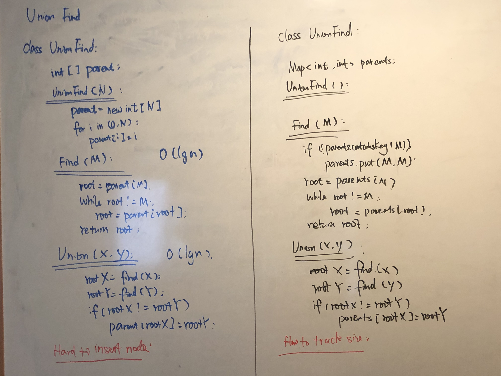
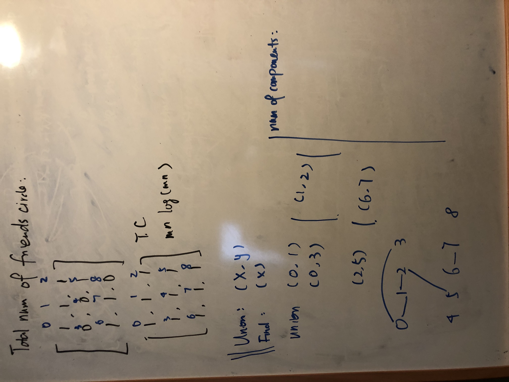
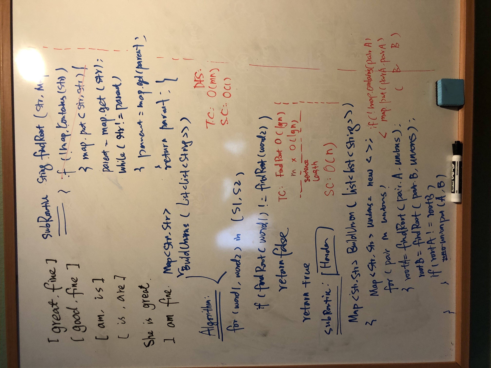

# union find 

## Most basic way

```python
def find(a):
    if a not in ancestors:
        ancestors[a] = a
        groupSize[a] = 1
    if a != ancestors[a]:
        ancestors[a] = find(ancestors[a])
    return ancestors[a]

# here we assume the find root operation is done in the upper layer
# so the parameters are named as rootA, rootB
# it gives much more flexibility into how to use the algorithm
def union(rootA, rootB): 
    if groupSize[rootA] > groupSize[rootB]:
        groupSize[rootA] += groupSize[rootB] 
        ancestors[rootB] = ancestors[rootA]
    else:
        groupSize[rootB] += groupSize[rootA] 
        ancestors[rootA] = ancestors[rootB]

# here we assume both the ancestors and groupSize are dictionary.
# dictionary is more generic than the typical implementation based on top of array.
ancestors = {}
groupSize = {}

# ...
aRoot, bRoot = find(a), find(b)
if aRoot != bRoot:
    union(aRoot, bRoot)
# ...

```

## Calculate the number of components

```python
ancestors = {}

# ...

# the number of components could be computed on top of ancestors dictionary
return sum([1 for k, v in ancestors.items() if k == v])

# An alternative way, not as good as the one above
collections.Counter([find(x) for x in range(numStone)])

```

## Calculate each item's component size

```python
return [find(i) for i in ancestors.keys()]
```

## Calculate the largest component size

```python
groupSize = {}

return max([v for v in groupSize.values()])
```

## Implementation based on rank

```python
def find(a: int) -> int:
    if ancestors[a] != a:
        ancestors[a] = find(ancestors[a])

    return ancestors[a]

def union(a: int, b: int):
    rootA, rootB = find(a), find(b)
    if rank[rootA] > rank[rootB]:
        ancestors[rootB] = ancestors[rootA]
    else:
        ancestors[rootA] = ancestors[rootB]
        if rank[rootA] == rank[rootB]:
            rank[rootB] += 1
```






